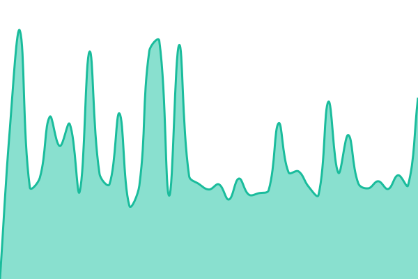
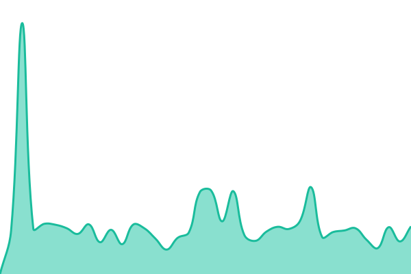
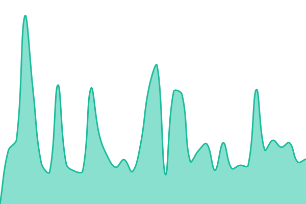

# [📈 Live Status](https://Sabari-Vijayan.github.io/status.app.ktu.in): <!--live status--> **🟩 All systems operational**

This repository contains the open-source uptime monitor and status page for [Sabari Vijayan](https://Sabari-Vijayan.github.io/status.app.ktu.in), powered by [Upptime](https://github.com/upptime/upptime).

With [Upptime](https://upptime.js.org), you can get your own unlimited and free uptime monitor and status page, powered entirely by a GitHub repository. We use [Issues](https://github.com/Sabari-Vijayan/status.app.ktu.in/issues) as incident reports, [Actions](https://github.com/Sabari-Vijayan/status.app.ktu.in/actions) as uptime monitors, and [Pages](https://Sabari-Vijayan.github.io/status.app.ktu.in) for the status page.

<!--start: status pages-->
<!-- This summary is generated by Upptime (https://github.com/upptime/upptime) -->
<!-- Do not edit this manually, your changes will be overwritten -->
<!-- prettier-ignore -->
| URL | Status | History | Response Time | Uptime |
| --- | ------ | ------- | ------------- | ------ |
|  [KTU Main Website](https://ktu.edu.in) | 🟩 Up | [ktu-main-website.yml](https://github.com/Sabari-Vijayan/status.app.ktu.in/commits/HEAD/history/ktu-main-website.yml) | 

 3931ms
     
 | 

<a href="https://Sabari-Vijayan.github.io/status.app.ktu.in/history/ktu-main-website">95.02%</a>
    

|  [e-Governance Portal](https://app.ktu.edu.in) | 🟩 Up | [e-governance-portal.yml](https://github.com/Sabari-Vijayan/status.app.ktu.in/commits/HEAD/history/e-governance-portal.yml) | 

 1784ms
     
 | 

<a href="https://Sabari-Vijayan.github.io/status.app.ktu.in/history/e-governance-portal">100.00%</a>
    

|  [Results Portal](https://ktu.edu.in/eu/ex/result.htm) | 🟩 Up | [results-portal.yml](https://github.com/Sabari-Vijayan/status.app.ktu.in/commits/HEAD/history/results-portal.yml) | 

 217ms
     
 | 

<a href="https://Sabari-Vijayan.github.io/status.app.ktu.in/history/results-portal">100.00%</a>
    

|  [Certificate Verification](https://ktu.edu.in/eu/auth/verification.htm) | 🟩 Up | [certificate-verification.yml](https://github.com/Sabari-Vijayan/status.app.ktu.in/commits/HEAD/history/certificate-verification.yml) | 

 217ms
     
 | 

<a href="https://Sabari-Vijayan.github.io/status.app.ktu.in/history/certificate-verification">100.00%</a>
    

|  [Academic Calendar](https://ktu.edu.in/eu/acad/academicCalendar.htm) | 🟩 Up | [academic-calendar.yml](https://github.com/Sabari-Vijayan/status.app.ktu.in/commits/HEAD/history/academic-calendar.yml) | 

 217ms
     
 | 

<a href="https://Sabari-Vijayan.github.io/status.app.ktu.in/history/academic-calendar">100.00%</a>
    

<!--end: status pages-->

[**Visit our status website →**](https://Sabari-Vijayan.github.io/status.app.ktu.in)

## 📄 License

- Powered by: [Upptime](https://github.com/upptime/upptime)
- Code: [MIT](./LICENSE) © [Anand Chowdhary](https://anandchowdhary.com), supported by [Pabio](https://pabio.com)
- Data in the `./history` directory: [Open Database License](https://opendatacommons.org/licenses/odbl/1-0/)
